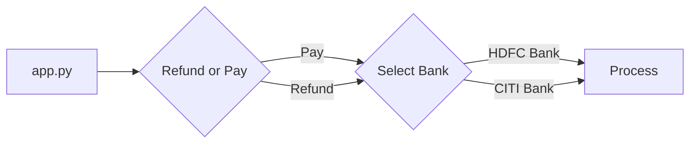

# Intro
This repo is to provide the basic syntax about the **Strategy Design Pattern** and the interface in python forcing subclasses to implement the required functionality.

```mermaid
flowchart LR
    A[app.py] --> B{Refund or Pay}
    B -- Pay --> C{Select Bank}
    B -- Refund --> C{Select Bank}
    C -- HDFC Bank --> D[Process]
    C -- CITI Bank --> D[Process]
```